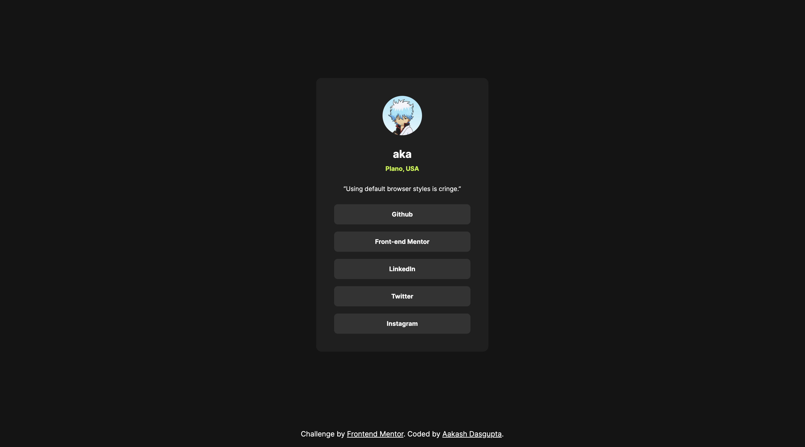

# Frontend Mentor - Social links profile solution

This is a solution to the [Social links profile challenge on Frontend Mentor](https://www.frontendmentor.io/challenges/social-links-profile-UG32l9m6dQ).

## Table of contents

- [Overview](#overview)
  - [The challenge](#the-challenge)
  - [Screenshot](#screenshot)
  - [Links](#links)
- [My process](#my-process)
  - [Built with](#built-with)
  - [What I learned](#what-i-learned)
- [Author](#author)

## Overview

### The challenge

Users should be able to:

- See hover and focus states for all interactive elements on the page

### Screenshot



### Links

- Solution URL: [Add solution URL here](https://github.com/a-d14/social-links-frontend-mentor)
- Live Site URL: [Add live site URL here](https://a-d14.github.io/social-links-frontend-mentor/)

## My process

### Built with

- Semantic HTML5 markup
- CSS custom properties
- Flexbox
- Mobile-first workflow

### What I learned
- Learned the concept of variable fonts and how they can be used to reduce the size of your web application.
- Learned how to import fonts from a .ttf file using ```@font-face```

## Author
- Frontend Mentor - [@a-d14](https://www.frontendmentor.io/profile/a-d14)
